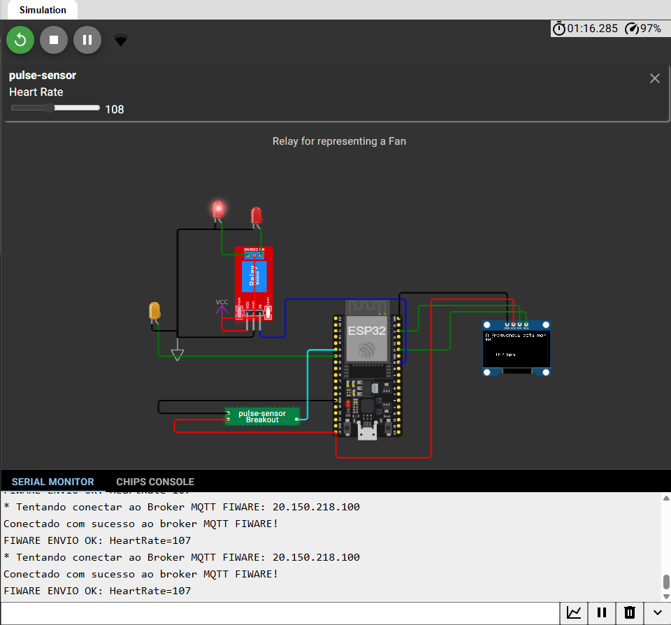

#  Validação da Arquitetura IoT 

##  Objetivo do Projeto (Sprint 4)

O objetivo é estabelecer uma **Prova de Conceito (PoC)** de uma arquitetura de monitoramento de telemetria em tempo real, utilizando a plataforma **FIWARE** para gerenciar o histórico de dados de um dispositivo simulado (Wokwi/ESP32).

O foco principal é garantir a **persistência e consulta do histórico completo**, quebrando o filtro padrão de 7 dias do Dashboard.

---
## 🧑‍💻 Integrantes

| Gabrielle Zollner | 564460 | 
| Pedro Batista | 563220 | 
| João Felipe Bertini | 563478 |

**Link para o Código Fonte Completo:** [https://github.com/PedroH-Batista/Sprint4-edge.git]
** Link Wokwi:** [https://wokwi.com/projects/442120288196591617]

---
##  Setup da Infraestrutura FIWARE (Ambiente Limpo)

A infraestrutura foi baseada no seguinte esquema.

| Componente | Função | Configuração de Acesso | Porta |
| :--- | :--- | :--- | :--- |
| **VM Azure (Host)** | Hospedagem dos contêineres Docker. | **IP Público:** `20.150.218.100` | - |
| **Service Tenant** | Identificador do projeto (Substitui `passabola`/`testservice`). | `Fiware-Service`: **`cp5sprint`** | - |
| **IoT Agent (Entrada de Dados)** | Roteia os dados do Wokwi para o Orion. | `resource`: `/iot/d` | `4041` |
| **Context Broker** | Gerenciamento central do estado (`Atleta:001`). | Orion | `1026` |
| **STH-Comet (Histórico)** | Persistência da série temporal. | STH-Comet | `8666` |
| **Dispositivo** | Sensor de Telemetria (Wokwi/ESP32). | ID: `sensor_wokwi_001` | - |

---
## Provas de Funcionamento e Persistência de Dados

Esta seção comprova que a comunicação está ativa e que os dados estão sendo salvos e consultados corretamente.

### 1 Configuração da Comunicação (FIWARE)

| Etapa | Requisito Comprovado | Status Esperado |
| :--- | :--- | :--- |
| **Service Group Provisioning** | Ativação da rota `/iot/d` no Tenant **`cp5sprint`**. | `201 Created` |
| **Device Provisioning** | Associa a entidade `Atleta:001` ao sensor e Service `cp5sprint`. | `201 Created` |
| **Subscription (Histórico)** | Criação da *Subscription* que envia dados de `Atleta:001` para o **STH-Comet**. | `201 Created` |
| **Envio de Dados Reais** | O Wokwi envia continuamente o *payload* (ex: `fc|130|vm|35.2`) para a porta 4041. | `200 OK` (Estável) |
| **** | *O Console do Wokwi comprova o envio contínuo para o IP do Broker.* |  |

### 2 Consulta e Validação do Histórico Completo (PoC)

Esta é a prova da quebra do filtro de tempo e a solução para o problema do Dashboard.

| Artefato | Prova de Funcionamento (Comprovação da Solução) |
| :--- | :--- |
| **Consulta em Tempo Real** | O Postman consultando o Orion (`GET /v2/entities/Atleta:001`) retorna o status **`200 OK`** e mostra os valores numéricos em tempo real (`frequenciaCardiaca`, `velocidadeMaxima`). |
| **Histórico Completo (STH)** | A consulta direta ao STH-Comet (Porta **`8666`**) retorna o JSON da série temporal com todos os registros, graças ao parâmetro **`&lastN=999999`** no Query Param. |
| **** | *Print do JSON de resposta do STH com múltiplas entradas de histórico.* |
| **Dashboard Final** | O Dashboard carrega os gráficos de *Frequência Cardíaca* e *Velocidade Máxima* com a série temporal completa desde o início da coleta. |
| **** | *Print do Dashboard exibindo a visualização da série temporal completa.* |

---
## 3. Estrutura do Repositório e Reprodução

O projeto pode ser reproduzido com o seguinte fluxo:

1.  **Infraestrutura:** O arquivo `docker-compose.yml` (completo) sobe todos os GEs.
2.  **Provisionamento:** As requisições Postman (usando **`Fiware-Service: cp5sprint`**) configuram o pipeline.
3.  **Código do Dashboard:** O arquivo `useFiwareData.js` no frontend usa a URL de consulta corrigida:
    
    `http://20.150.218.100:8666/v1/contextEntities/type/Atleta/id/Atleta:001/attributes?aggrMethod=raw&lastN=999999`
